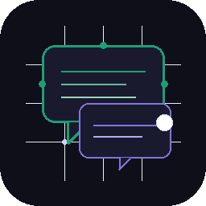

<h1 align="center">🏠 Agent Meeting Room</h1>

<p align="center">
  
</p>

<p align="center">
  A Flask web app where you <code>@mention</code> AI agents into a live group chat.<br/>
  Local models via Ollama · Claude API on demand · Streaming debates · Obsidian memory · Add unlimited agents
</p>

<p align="center">
  
  
  
  
  
</p>

<br/>

<p align="center">
  
</p>

---

## What it does

Imagine a group chat where everyone at the table is an AI — each with a different personality, model, and reasoning style. You type a message, mention the agents you want, and they all respond. You can spark a structured debate, run a free-form group discussion via live streaming, or pull in Claude as the senior voice in the room.

- **@mention routing** — only the agents you tag reply
- **Debate mode** — structured 3-round argument with a final summary
- **Free Talk** — agents stream a live discussion on any topic via SSE
- **Memory** — save meeting notes directly to an Obsidian vault
- **Claude agent command** — Claude API joins as the "headmaster" on demand

---

## Agents

All local agents run **any Ollama-compatible model** — swap by editing the `"model"` field in `agents.py`. Defaults are chosen to run under 8GB VRAM.

| Agent | Default Model | VRAM | Personality |
|---|---|---|---|
| `@mistral` | `mistral` | ~4 GB | Sharp analytical thinker |
| `@phi3` | `phi3` | ~2 GB | Creative lateral thinker |
| `@gemma2` | `gemma2:2b` | ~1.5 GB | Balanced careful summarizer |
| `@deepseek` | `deepseek-r1:7b` | ~4.7 GB | Deep step-by-step reasoner |
| <code>&#64;claude</code> | `claude-sonnet-4-5` | API | Collaborative nuanced advisor |

> **Swap a model:** open `agents.py` → change the `"model"` value to anything from `ollama list`.

---

## Adding your own agents — unlimited LLMs

The `AGENTS` dict in `agents.py` is the only place you need to touch. You can add **as many models as your hardware can handle** — any model in `ollama list` works.

**Step 1 — pull the model**
```bash
ollama pull llama3
ollama pull qwen2:7b
ollama pull codellama
# or any model from https://ollama.com/library
```

**Step 2 — add an entry to `agents.py`**
```python
"llama3": {
    "model":       "llama3",          # must match exactly what ollama list shows
    "name":        "Llama3",          # display name in the UI
    "color":       "#E8A838",         # any hex color for the chat bubble
    "personality": """You are Llama3, a well-rounded and helpful thinker.
You are direct, practical, and friendly. Keep responses under 150 words
unless asked for detail. You are in a group meeting with other AI agents."""
},
```

**Step 3 — restart the app.** Your new agent shows up in the agents bar automatically and is @mentionable by the key name (e.g. `@llama3`).

> **Hardware guidance**
> | VRAM | What runs comfortably |
> |------|----------------------|
> | 6–8 GB | 2–3 agents simultaneously (e.g. Mistral + Phi3 + Gemma2) |
> | 12–16 GB | 4–5 agents (full default set + 1–2 extras) |
> | 24 GB+ | 6+ agents, larger 13B+ models |
>
> Agents load on-demand per message — you're not running them all in parallel unless using `@all` or `@debate`.


---

## Customization

Agent Meeting Room is meant to feel like your own digital table, not a fixed demo. Open **Customize** to tune the room without changing code:

| Customization | Behavior |
|---|---|
| Agent display names | Rename agents in the UI without changing the `@mention` key |
| Agent avatars | Choose an image/logo URL or use the generated initials fallback |
| Agent accent colors | Pick each agent's chip, name, and message highlight color |
| Persona cards | Edit role, tone, expertise, and meeting behavior from a simple form |
| Saved presets | Save and load teams such as Product Review, Code Review, Debate Panel, or Creative Room |
| Room identity | Set an optional room title, purpose, and logo for demos or recurring meetings |
| Free Talk duration | Choose short or long discussions, from quick 5-minute syncs to longer 30-minute sessions |
| TTS voices | Let browser speech synthesis read agent replies, with optional voice name hints per agent |

Customizations are stored locally in `agent_profiles.json`, which is ignored by Git so each room can keep its own private setup.

---

## Download & install

### Option A — Portable EXE (simplest)
1. Go to [**Releases**](https://github.com/GhravenLabs/Agent-Meeting-Room/releases/latest)
2. Download `AgentMeetingRoom.exe`
3. Double-click — browser opens automatically

### Option B — Build the Windows installer
The repo includes `AgentMeetingRoom_Setup.iss` for Inno Setup if you want a full installer with desktop and Start Menu shortcuts.

1. Run `build.bat` to create `dist/AgentMeetingRoom.exe`
2. Open `AgentMeetingRoom_Setup.iss` with [Inno Setup 6](https://jrsoftware.org/isinfo.php)
3. Build the setup package — output is written to `dist/`

> **Prerequisite for both:** [Ollama](https://ollama.com) must be installed and at least one model pulled.
> ```bash
> ollama pull mistral
> ```

### Option C — Run from source (developers)
See [Quick Start](#quick-start) below.


---

## Quick Start

### Step 1 — Install Ollama (required)

Ollama runs the local AI models. **Without it, local agents won't respond.**

| Platform | Download |
|----------|----------|
| Windows  | [ollama.com/download/windows](https://ollama.com/download/OllamaSetup.exe) |
| macOS    | [ollama.com/download/mac](https://ollama.com/download/Ollama-darwin.zip) |
| Linux    | `curl -fsSL https://ollama.com/install.sh \| sh` |

After installing, pull at least one model:
```bash
ollama pull mistral        # ~4 GB — recommended starting point
ollama pull phi3           # ~2 GB — lightweight
ollama pull gemma2:2b      # ~1.5 GB — very lightweight
ollama pull deepseek-r1:7b # ~4.7 GB — deep reasoning
```
> Ollama must be **running** before you start Agent Meeting Room.  
> It starts automatically on Windows/macOS after install. On Linux: `ollama serve`

---

### Step 2 — Clone and install Python dependencies

```bash
git clone https://github.com/GhravenLabs/Agent-Meeting-Room
cd Agent-Meeting-Room
pip install -r requirements.txt
```

Requires **Python 3.11+**. Check with `python --version`.

---

### Step 3 — Configure (copy .env)

```bash
cp .env.example .env
```

Open `.env` and set:

| Variable | Required? | What it does |
|----------|-----------|--------------|
| `ANTHROPIC_API_KEY` | Optional | Enables the Claude agent command — get one at [console.anthropic.com](https://console.anthropic.com) |
| `MEMORY_BACKEND` | Optional | `local` (default), `obsidian`, or `none` |
| `OBSIDIAN_VAULT_PATH` | Optional | Only if `MEMORY_BACKEND=obsidian` |

**Memory is optional.** By default it saves notes to `./meeting_notes/` next to `app.py` — no Obsidian needed.

---

### Step 4 — Run

```bash
python app.py
# Windows: double-click start.bat
```

Open **http://localhost:5000**

The startup log tells you exactly what's working:
```
==================================================
  Agent Meeting Room
==================================================
  ✓ Ollama running  (4 model(s) available)
      · mistral
      · phi3
      · gemma2:2b
      · deepseek-r1:7b
  ✓ Memory: local folder  (./meeting_notes)
  · Claude API: no key set  (Claude agent will not respond)
    → Add ANTHROPIC_API_KEY to .env for the Claude agent
==================================================
  Open: http://localhost:5000
==================================================
```

---

## Testing

Run the built-in test suite with Python's standard `unittest` runner:

```bash
python -m unittest discover -s tests
# Windows: double-click test.bat
```

The tests cover customization persistence, Flask route validation, Free Talk duration clamping, and memory note filename handling.

---

## Usage

| What you type | What happens |
|---|---|
| `@mistral explain quantum computing` | Only Mistral replies |
| `@phi3 @gemma2 brainstorm ideas` | Phi3 and Gemma2 reply |
| `@all what should I build next?` | All local agents reply |
| <code>&#64;claude review this plan</code> | Claude API responds |
| `@debate is AI good or bad?` | 3-round structured debate |
| *(no mention)* | All local agents reply |

For **Free Talk**, click the Free Talk button → give a topic → agents discuss live in real time.

---

## Project Structure

```
agent-meeting-room/
├── app.py              Flask routes and SSE streaming
├── agents.py           Agent definitions, Ollama + Claude calls, debate logic
├── memory.py           Obsidian vault integration
├── templates/
│   └── index.html      Single-page frontend (Vanilla JS + SSE)
├── start.bat           Windows one-click launcher
├── .env.example        Environment variable template
└── requirements.txt
```

---

## Requirements

| Requirement | Required? | Notes |
|-------------|-----------|-------|
| Python 3.11+ | ✅ Required | [python.org](https://python.org) |
| [Ollama](https://ollama.com) | ✅ Required | For local agents — must be running |
| Anthropic API key | Optional | Only for the Claude agent command |
| [Obsidian](https://obsidian.md) | Optional | Only if you want Obsidian memory — not needed |

---

## Tech Stack

**Backend:** Python · Flask · Server-Sent Events  
**Local AI:** Ollama (Mistral · Phi3 · Gemma2 · DeepSeek)  
**Cloud AI:** Anthropic Claude API  
**Frontend:** Vanilla JS · SSE streaming  
**Memory:** Pluggable — local folder (default) · Obsidian vault (optional) · or disabled  

---

## License

MIT — see [LICENSE](LICENSE)

---

## Contributing

See [CONTRIBUTING.md](CONTRIBUTING.md) — adding a new agent takes about 5 lines.

## Changelog

See [CHANGELOG.md](CHANGELOG.md) for release history.
